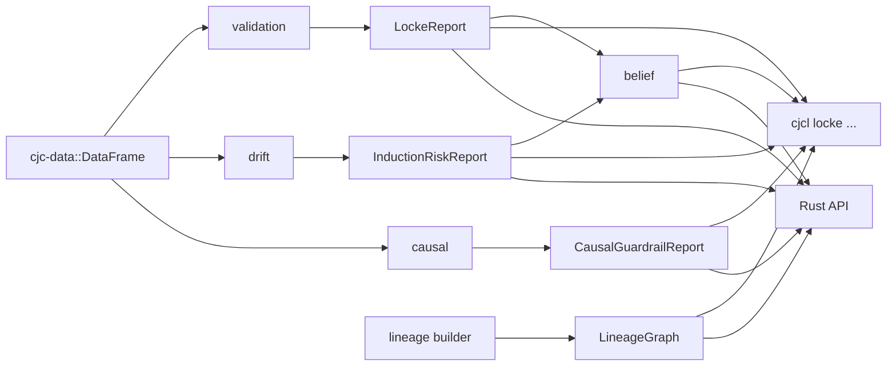
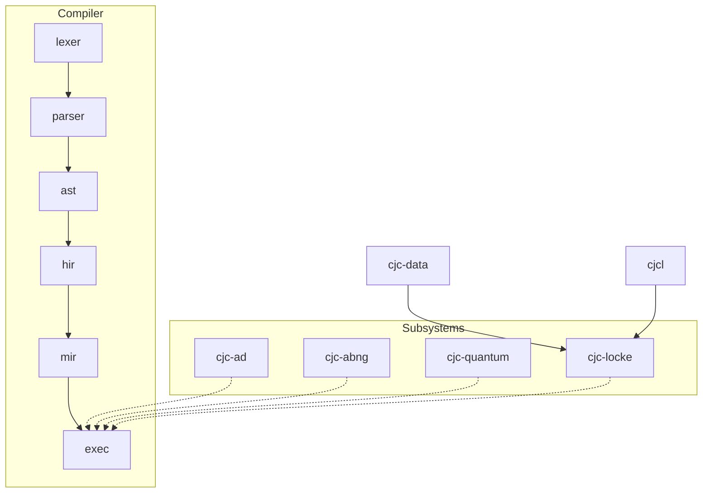

# Locke Architecture

## High-level shape



Every box in this diagram corresponds to a `pub mod` in the `cjc-locke` crate:

| Module               | Responsibility |
|---------------------|----------------|
| `cjc_locke::id`     | Deterministic 64-bit content fingerprints (SplitMix64-based, domain-salted) |
| `cjc_locke::report` | `LockeReport`, `ValidationFinding`, severity, structured evidence |
| `cjc_locke::stats`  | Kahan-summed mean / std / variance / Pearson / histograms |
| `cjc_locke::validation` | missingness, duplicates, schema, impossible, constant, cardinality |
| `cjc_locke::drift`  | train/test compare: mean/std/range/PSI/TVD/missingness |
| `cjc_locke::lineage`| `LockeImpression`, `LockeIdea`, `LineageBuilder`, `LineageGraph` |
| `cjc_locke::belief` | `BeliefScore` per-dimension breakdown + aggregator |
| `cjc_locke::causal` | conservative correlation→causation warnings + confounder hints |
| `cjc_locke::api`    | high-level facade (`validate`, `compare`, `belief_report_from_locke`, `causal_guardrail`) |

## Determinism contract

Locke's architecture enforces five invariants:

1. **IDs are content-addressed.** Every `FingerprintId` is a function of (domain salt, canonical bytes). Repeated runs over the same inputs produce identical IDs.
2. **All maps in emitted output use `BTreeMap`/`BTreeSet`.** Never `HashMap`/`HashSet` with non-deterministic iteration.
3. **All float reductions use `cjc_repro::KahanAccumulatorF64`.** No FMA, no `f64::mul_add` in numeric kernels.
4. **Missing-value semantics are explicit.** `NaN` is "missing" for `Column::Float`; for other types Locke v0 emits an `E9002` limitation note rather than silently treating sentinel values as null.
5. **No wall-clock timestamps.** Audit chains use monotonic `seq` numbers scoped to a `run_label`, content-addressed.

## Where Locke fits in CJC-Lang



Locke is a *subsystem* like `cjc-ad` or `cjc-quantum` — it depends on `cjc-data` and `cjc-repro` and is exposed through `cjcl locke …`. It is **not** part of the compiler pipeline; it does not change Lexer/Parser/AST/HIR/MIR.

## Integration points

- **`cjc-data::DataFrame`** — the only required dataset surface.
- **`cjc-repro`** — Kahan accumulators and (future) SplitMix64 seeding for stratified-sample helpers.
- **`cjc-cli`** — `commands/locke.rs` registers a `locke` subcommand.
- **`cjc-snap`** — *not used in v0.* Locke writes its own text/JSON emit; we can swap in `cjc-snap::SnapBlob` for binary serialisation in v0.2 if needed.
- **`cjc-abng`** — *not used in v0.* ABNG's `drift`/`audit`/`merkle` are tree-node-oriented; Locke is column/row-oriented. Patterns are mirrored, code is not shared.

## Files added

```
crates/cjc-locke/
├── Cargo.toml
└── src/
    ├── lib.rs
    ├── id.rs
    ├── report.rs
    ├── stats.rs
    ├── validation.rs
    ├── drift.rs
    ├── lineage.rs
    ├── belief.rs
    ├── causal.rs
    └── api.rs

crates/cjc-cli/src/commands/locke.rs   ← new subcommand

tests/locke/
├── mod.rs
├── validation_tests.rs
├── drift_tests.rs
├── lineage_tests.rs
├── belief_tests.rs
├── causal_tests.rs
├── determinism_tests.rs
├── locke_proptest.rs
└── locke_fuzz.rs
```

See [[Locke Roadmap]] for what's next.
