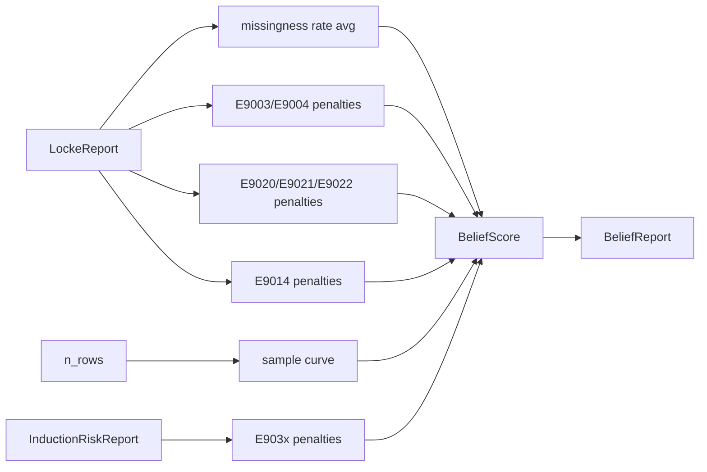

# Locke Belief Reports

> A `BeliefScore` is not a magic number. It's the average of explicit per-dimension sub-scores, each one explainable.

## The eight dimensions

| Dimension              | Range    | What pulls it down |
|------------------------|----------|--------------------|
| `schema_score`         | [0, 1]   | E9020 / E9021 / E9022 findings |
| `missingness_score`    | [0, 1]   | column-level NaN rate (averaged) |
| `drift_score`          | [0, 1]   | E903x findings from `compare(...)` |
| `leakage_score`        | [0, 1]   | (placeholder — defaults to 1.0 in v0; v0.2 adds heuristics) |
| `lineage_score`        | [0, 1]   | (placeholder — defaults to 1.0 when no graph supplied) |
| `sample_score`         | [0, 1]   | `1 − exp(-n / k)`, tuned so n=30 ≈ 0.5, n=500 ≈ 0.95 |
| `duplication_score`    | [0, 1]   | E9003 / E9004 findings |
| `constraint_score`     | [0, 1]   | E9014 findings (impossible-value violations) |

The **overall** score is the unweighted mean of the eight sub-scores by default. **v0.2 adds user-tunable weights** via `BeliefWeights`.

## User-tunable weights (v0.2)

```rust
use cjc_locke::{BeliefScore, BeliefWeights};

let mut w = BeliefWeights::default();
w.missingness = 10.0;   // I care about missingness 10x more than the others
w.duplication = 5.0;

let score = BeliefScore::from_dimensions_weighted(
    schema_score, missingness_score, drift_score, leakage_score,
    lineage_score, sample_score, duplication_score, constraint_score,
    &w,
);
```

Defaults are equal weights (every field = 1.0), so `from_dimensions_weighted(..., BeliefWeights::default())` is bit-equivalent to v0.1's `from_dimensions(...)`. Negative weights and NaN weights are clamped to 0 (see `BeliefWeights::from_values`). If every weight is zero, overall is `0.0`.

Determinism: weights are simple numeric scalars; the weighted-mean uses the same Kahan accumulator as the v0.1 unweighted path.

## Why a breakdown matters

A single number — "your data is 0.65 confident" — is useless without an explanation. Locke always shows the breakdown:

```text
overall=0.857
  schema      = 1.000
  missingness = 1.000
  drift       = 1.000
  leakage     = 1.000
  lineage     = 1.000
  sample      = 0.109
  duplication = 0.750
  constraint  = 1.000
```

In this example the score is pulled down by:

- `sample` — only 5 rows in the dataset (n=30 is the half-point)
- `duplication` — there's at least one duplicate row in the data

## The penalty model (v0)

Each finding in a relevant `code` set contributes a penalty:

| Severity | Penalty |
|----------|---------|
| Info / Notice | 0.02   |
| Warning  | 0.10   |
| Error    | 0.25   |

A sub-score = `max(0, 1 − Σ penalties)`. This is intentionally a simple linear model in v0; future versions can use evidence-weighted penalties (e.g., scale by `violation_rate`).



## When evidence is absent

If a dimension has no evidence (e.g. no comparison frame supplied so drift_score has nothing to look at), Locke sets it to `1.0` **and** appends an assumption to the report:

> drift_score = 1.0 by default (no comparison dataframe supplied)

This prevents "no evidence" from artificially boosting the overall without acknowledgement.

## API

```rust
use cjc_locke::api::{validate, validate_and_compare, belief_report_from_locke};
use cjc_locke::validation::ValidationConfig;

let opts = ValidateOptions {
    dataset_label: "train.csv".into(),
    config: ValidationConfig::default(),
    ..Default::default()
};

// Single-frame belief:
let report = validate(&df, &opts);
let belief = belief_report_from_locke(&report);
println!("{}", belief.score.explain());

// Combined validate + drift + belief:
let (val, drift, belief) =
    validate_and_compare(&train, &test, &opts, &DriftConfig::default());
```

## Sample-score curve

```text
n     score
0     0.000
30    0.500   ← half-point
100   0.901
500   0.950
1000  0.990
```

The shape is `1 - exp(-n / 43.281)` with `k = -30 / ln(0.5)`. This is not a calibrated statistical-power calculation — it's an interpretable smoothing function so that the score is not a step at some arbitrary threshold.

## Properties (verified by proptest)

- `overall ∈ [0, 1]` for every input, including NaN sub-scores (NaN clamps to 0).
- Adding more missingness never improves `missingness_score`.
- `sample_score_from_n(n)` is monotonically non-decreasing in `n`.
- The full belief calculation is bit-identical across repeated runs.

## Tests

- `crates/cjc-locke/src/belief.rs` — 7 unit tests
- `tests/locke/belief_tests.rs` — 5 integration tests
- `tests/locke/locke_proptest.rs` — generative properties (3 of them target belief invariants)
