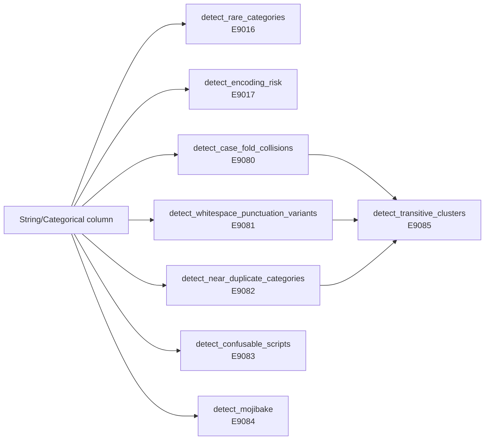
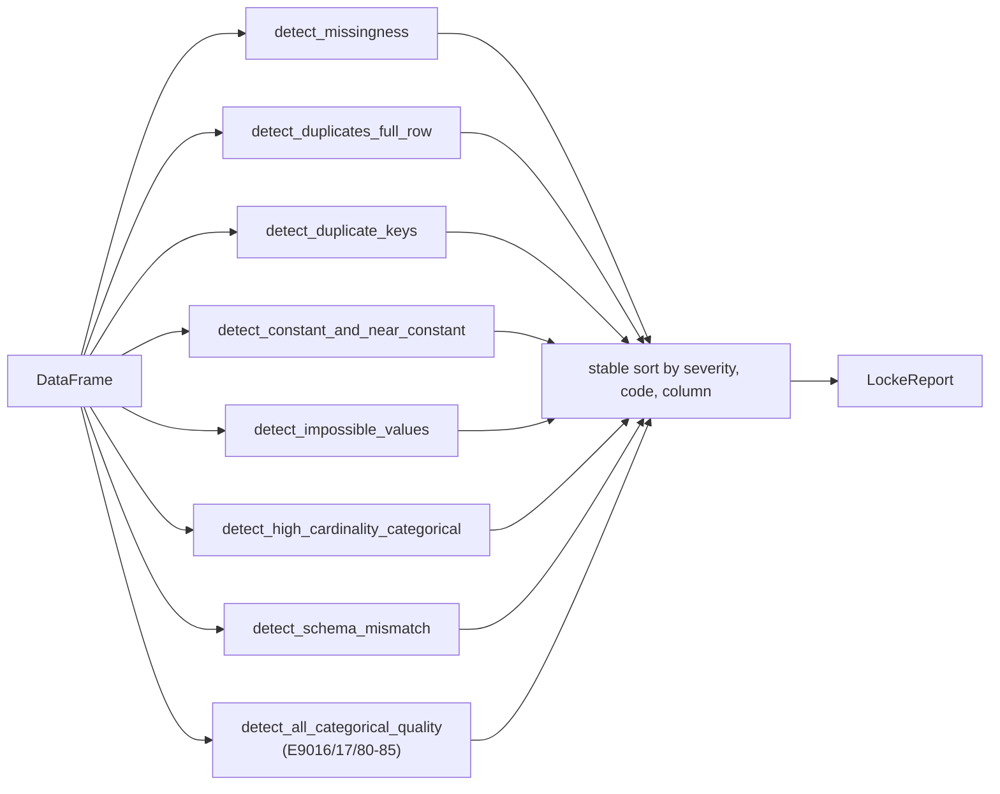

# Locke Data Skepticism

## What it does

Locke's `validation` module asks the boring-but-important questions:

- Is anything missing?
- Are rows duplicated?
- Are there impossible values?
- Are any columns constant or near-constant?
- Is the schema what we expect?
- Is any categorical column suspiciously high-cardinality?

Each check emits zero or more `ValidationFinding`s. A finding is a structured record — never free text — containing severity, evidence, assumptions, and suggested next checks.

## Validators

| Code   | Check                                              | Default severity policy |
|--------|----------------------------------------------------|--------------------------|
| E9001  | NaN-as-missing in `Column::Float` **OR** null-mask missingness in any column (v0.2) | rate ≥ 0.5 → Error; ≥ 0.1 → Warning; else Notice |
| E9002  | Non-float column with no null mask supplied        | Info |
| E9003  | Full-row duplicates                                | rate ≥ 0.2 → Error; ≥ 0.05 → Warning; else Notice |
| E9004  | Duplicate values in named key column                | Error |
| E9005  | Key column not found                                | Error |
| E9006  | Null mask contains out-of-bounds indices (v0.2)     | Warning |
| E9010  | Constant column (`n_distinct == 1`)                 | Warning |
| E9011  | Near-constant (top freq ≥ 0.99)                     | Notice |
| E9012  | Impossible-value rule references missing column     | Error |
| E9013  | Rule-column type mismatch                           | Warning |
| E9014  | Impossible-value violations                         | rate ≥ 0.1 → Error; ≥ 0.01 → Warning; else Notice |
| E9015  | High-cardinality categorical (ratio ≥ 0.5)          | Notice |
| E9016  | Rare categories (`count < rare_category_min_count`) — v0.6 | Notice |
| E9017  | One-hot encoding-risk (cardinality > threshold) — v0.6 | Notice |
| E9018  | Categorical cardinality explosion train→test — v0.6 batch 2 | Notice or Warning |
| E9019  | Categorical entropy shift between train and test — v0.6 batch 2 | Notice |
| E9023  | Int column densely packed in small range — label-encoding risk — v0.6 batch 2 | Notice |
| E9024  | Distribution shape outside normal range (skew, kurtosis) — v0.6.3 | Notice |
| E9063  | Multi-class target leakage via one-vs-rest AUC — v0.6.3 | Warning or Error |
| E9020  | Expected column is missing                          | Error |
| E9021  | Column has wrong type                               | Error |
| E9022  | Column is not in the expected schema                | Error or Notice (controlled by `strict_extra`) |
| E9080  | Case-fold collisions ("Premium"/"premium") — v0.6  | Warning |
| E9081  | Whitespace / terminal-punctuation variants — v0.6  | Notice |
| E9082  | Near-duplicate categories (Levenshtein ≤ 2) — v0.6 | Warning |
| E9083  | Confusable mixed-script labels (Latin + Cyrillic) — v0.6 | Warning |
| E9084  | Mojibake (UTF-8 decoded as Latin-1) — v0.6        | Notice |
| E9085  | Transitive cluster summary across E9080/81/82 — v0.6 | Notice |
| E9086  | Unicode NFC/NFD normalisation variants — v0.6 batch 2 | Warning |
| E9090  | Email-like values detected (≥ 10% of column) — v0.6 batch 2 | Warning |
| E9091  | Phone-like values detected — v0.6 batch 2 | Notice |
| E9092  | SSN-like values detected (`NNN-NN-NNNN`) — v0.6 batch 2 | Error |
| E9093  | API-key-like values detected (high entropy) — v0.6 batch 2 | Warning |
| E9055  | Time-column hour-of-day or day-of-week periodicity — v0.6 batch 2 | Notice |

## v0.6 categorical / string semantic-quality detectors

The `categorical` module surfaces semantic problems that the numeric-first validators miss. They run automatically as part of `validate_dataframe()` (see the validation flow diagram below) and are configurable through `CategoricalQualityConfig`. See [[Locke Roadmap]] §v0.6 for the full discussion of the eight new codes plus the deferred items (PII, ontology, taxonomy fragmentation).



The transitive-cluster summary `E9085` is *aggregating* — it inspects the prior E9080/E9081/E9082 findings and fires when ≥ 2 distinct channels agree on the same column. This makes the per-column semantic-quality picture readable even when the underlying findings are many.

The eight detectors map to BeliefScore axes:

| Code | Axis weakened |
|---|---|
| E9016 | `constraint` (distributional long-tail concern) |
| E9017, E9080–E9085 | `schema` (effective-alphabet ambiguity) |

## The validation flow



## The impossible-value DSL

```rust
use cjc_locke::ImpossibleValueRule;

let rules = vec![
    ImpossibleValueRule::NumericRange { column: "age".into(), min: 0.0, max: 120.0 },
    ImpossibleValueRule::NonNegative { column: "score".into() },
    ImpossibleValueRule::StrictlyPositive { column: "weight".into() },
    ImpossibleValueRule::AllowedInts { column: "rating".into(), allowed: vec![1, 2, 3, 4, 5] },
    ImpossibleValueRule::AllowedStrings {
        column: "country".into(),
        allowed: ["us".into(), "uk".into()].into_iter().collect(),
    },
];
```

Locke is conservative: a rule that doesn't match its column type emits **E9013** (Warning) and the validator continues — we don't silently coerce.

## Deterministic guarantees

- Row-canonical bytes for duplicate detection treat all NaN bit patterns as identical, so `NaN == NaN` under the duplicate hash. This is a deliberate choice — without it the duplicate count would be sensitive to which NaN payload happened to be in the column.
- Distinct-count for `Column::Float` is computed over canonicalised bit patterns (NaN folded to `u64::MAX`).
- `Column::CategoricalAdaptive` is treated as opaque in v0 — a conservative `n_distinct = column.len()` upper bound is used, and a future v0.2 hook will dereference the shared dictionary.

## Null masks (v0.2)

Locke v0.2 adds a `NullMask` type — a sparse `BTreeSet<usize>` of null row indices — that can be supplied per column:

```rust
use cjc_locke::{NullMask, NullMaskMap, ValidateOptions};

let mut masks = NullMaskMap::new();
masks.insert("country".into(), NullMask::from_indices([1, 7, 42]));
let opts = ValidateOptions {
    dataset_label: "train.csv".into(),
    null_masks: masks,
    ..Default::default()
};
let report = validate(&df, &opts);
// E9001 now fires with the supplied null counts for `country`.
```

For `Column::Float`, NaN positions are **unioned** with the mask positions. For other column types, the mask is the *only* source of missingness. Out-of-bounds mask indices are flagged as E9006 and skipped — a caller bug that should be fixed upstream.

When no mask is supplied for a non-float column, E9002 still fires as an Info-level acknowledgement (downgraded from v0.1's wording).

## Limitations

- The duplicate detector compares **entire rows byte-canonically** — it does not honour user-supplied "equality is up to column X" rules. Define a primary key and use `detect_duplicate_keys` for that case.
- Time-aware checks (sorted timestamps, future-leakage warnings) are deferred to v0.3 — see [[Locke Roadmap]].

## Tests

- `crates/cjc-locke/src/validation.rs` — 15 unit tests (12 v0.1 + 3 null-mask v0.2)
- `tests/locke/validation_tests.rs` — 9 integration tests (8 v0.1 + 1 null-mask v0.2)
- `tests/locke/locke_proptest.rs` — generative properties (missingness ≤ row count, more-NaN never improves score)
- `tests/locke/locke_fuzz.rs` — Bolero fuzz over arbitrary `Vec<f64>` / `Vec<i64>` inputs
