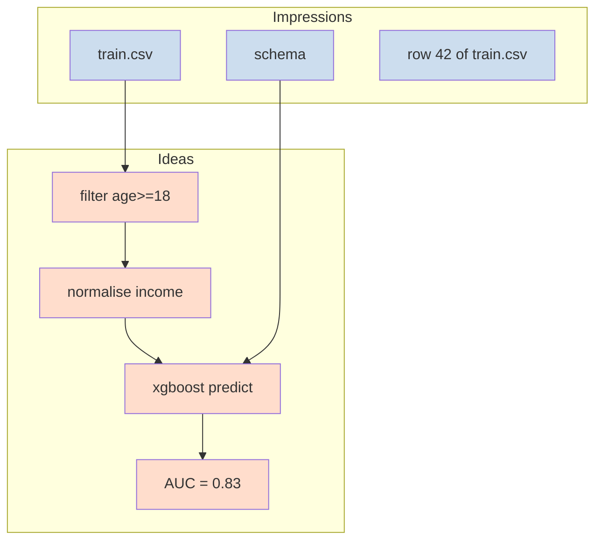

# Locke Impressions vs Ideas

> A hard semantic split between *observed* and *derived*.

## The distinction

| Concept             | What it is                                  | Example                       |
|---------------------|---------------------------------------------|-------------------------------|
| **Impression**      | A raw observed fact                          | "the CSV `train.csv` has 50k rows and columns [age, income, y]" |
| **Idea**            | Anything derived from an impression or another idea | "filtered to age ≥ 18", "one-hot of country", "ROC-AUC = 0.83" |

Impressions are leaves of the lineage DAG. Ideas are interior and root nodes. Edges go **only** from a parent (Impression or Idea) to a child Idea.



## Why this matters

Most data tools blur the line. They store "the average income" with the same status as "row 17's income" — but the average is a *claim about the world*, while row 17's income is an *observation*. Locke wants the consumer to be able to ask:

- "Where did this number come from?"
- "What raw facts is it ultimately built from?"
- "What transformations were applied?"
- "What parameters or seeds were used?"

By making Impressions and Ideas distinct types, lineage queries answer these without ambiguity.

## API

```rust
use cjc_locke::lineage::{
    LockeImpression, LockeIdea, ImpressionKind, TransformationRecord
};
use std::collections::BTreeMap;

// An impression: a raw fact about the dataset.
let imp = LockeImpression::new(
    /* source = */ "train.csv",
    ImpressionKind::Dataset,
    /* n_rows = */ 50_000,
    /* columns = */ vec!["age".into(), "income".into(), "y".into()],
);

// An idea: a derived value with at least one parent.
let filtered = LockeIdea::new(
    /* name = */ "filter_age_18_plus",
    TransformationRecord {
        op_id: "filter".into(),
        params: BTreeMap::from([("predicate".into(), "age >= 18".into())]),
        seed: None,
    },
    /* parents = */ vec![imp.id],
);
```

## What counts as which

| Thing                                           | Impression | Idea |
|------------------------------------------------|------------|------|
| The raw CSV file                                | ✅          |      |
| One value in a cell                             | ✅          |      |
| The dataset's schema                            | ✅          |      |
| A filtered subset of the rows                   |            | ✅    |
| A computed mean                                  |            | ✅    |
| A feature column (e.g. `age_squared`)            |            | ✅    |
| A model prediction                               |            | ✅    |
| An evaluation metric                             |            | ✅    |
| A train/test split                               |            | ✅ (the split is a derived choice) |
| A user-declared `CausalClaim`                    |            | ✅ (it's a claim, not an observation) |

## Why Ideas don't get a "type" enum

`LockeIdea` is intentionally generic — every idea carries a free-form `TransformationRecord { op_id, params, seed }`. We considered enumerating idea kinds (Filter / Aggregate / Feature / Prediction / Metric), but:

- The enumeration becomes a leaky abstraction that doesn't fit every domain.
- The `op_id` string is already content-addressed, so naming conventions are enforceable by the application without changing Locke.
- Future tooling can dispatch on `op_id` string prefixes (e.g. `filter:`, `predict:`) without breaking the wire format.

## Related

- [[Locke Lineage and Provenance]] — how Impressions and Ideas compose into a DAG
- [[Locke Belief Reports]] — how lineage completeness contributes to belief score
