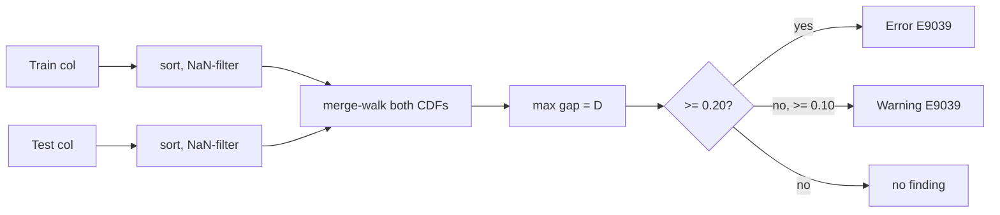
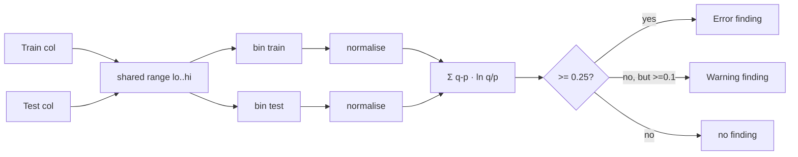

# Locke Induction Risk

> "Are you assuming the future looks like the past?"

The `drift` module compares two `DataFrame`s — usually train vs test, or train vs production — and surfaces evidence that one looks **different** from the other.

## What's checked

| Code  | Check                                  | Default thresholds |
|-------|----------------------------------------|--------------------|
| E9030 | Relative shift in column mean          | warn ≥ 0.10, error ≥ 0.30 |
| E9031 | Relative shift in column std-dev       | warn ≥ 0.25 |
| E9032 | Test range extends beyond train range  | Notice (extrapolation risk) |
| E9033 | *(v0.1)* PSI-style numeric distribution shift — retired in v0.2 default path; replaced by E9039 |  |
| E9034 | Categorical TVD shift / new levels     | warn ≥ 0.10, error ≥ 0.25 |
| E9035 | Missingness rate shifted ≥ 0.05         | Warning |
| E9036 | Small test set (n_test < 30)            | Warning |
| E9037 | Column in train but missing in test    | Error |
| E9038 | Column in test but missing in train    | Error |
| **E9039** | **Exact KS D-statistic** (v0.2 default)| **warn ≥ 0.10, error ≥ 0.20** |

## The KS D calculation (v0.2 default)

Exact Kolmogorov–Smirnov D-statistic on two empirical CDFs:

```text
D = sup_x |F_train(x) − F_test(x)|
```

Both samples are NaN-filtered and sorted with `f64::total_cmp` (deterministic across platforms). A merge-walk visits both sorted streams once and tracks the maximum CDF gap. O((n + m) · log(n + m)).



The `cjc_locke::stats::ks_d_statistic(xs, ys)` helper is also exposed as the `locke_ks_d(train, test)` builtin to CJC-Lang source.

## The PSI calculation (legacy — v0.1 default, kept as a helper)

Population Stability Index over equal-width bins computed on the **union** of train and test ranges:

```text
PSI = Σᵢ (qᵢ − pᵢ) · ln(qᵢ / pᵢ)
```

where `pᵢ`, `qᵢ` are normalised bin counts, floored at `ε = 1e-6` to keep `ln` finite. The default `n_bins = 10`.



## Categorical TVD

For string and categorical columns, Locke computes the **total variation distance** between normalised level frequencies:

```text
TVD = (1/2) Σ |p_level − q_level|
```

over the union of all observed levels. Levels in test but not train are explicitly counted and surfaced in the evidence record — a model trained without ever seeing those levels will behave unpredictably.

## What v0 does NOT do

- **Exact KS / CDF tests** — the bin-grid PSI is a deliberately simple proxy. v0.2 plans an exact Kolmogorov–Smirnov D statistic.
- **Label drift conditional on features** — that requires a model, not just summaries.
- **Time-split warnings** — Locke v0 has no notion of a time column. v0.2 adds `--time-col`.
- **Future-data leakage warnings** — requires time-awareness too.

Every drift finding's `assumptions` field documents the relevant caveat:

- "PSI is computed on equal-width bins over the union of train+test ranges"
- "population variance; not an F-test"
- "test data has values outside the train support" (range widening)

## Sample-size guard

If `n_test < small_sample_threshold` (default 30), Locke emits **E9036** *before* any per-column finding so the consumer sees the disclaimer up front. The default rationale: most distributional comparisons are unreliable with fewer than ~30 observations.

## API

```rust
use cjc_locke::drift::{compare, DriftConfig};

let report = compare(&train_df, &test_df, &DriftConfig::default());
println!("worst: {}", report.worst_severity());
for f in &report.findings {
    println!("  {} {}: {}", f.severity, f.code, f.message);
}
```

## Tests

- `crates/cjc-locke/src/drift.rs` — 7 unit tests including PSI sanity (identical→0, perpendicular→large)
- `tests/locke/drift_tests.rs` — 6 integration tests including the deterministic-run guarantee
- `tests/locke/locke_proptest.rs::drift_compare_is_deterministic_under_arbitrary_input` — 256 randomised cases
