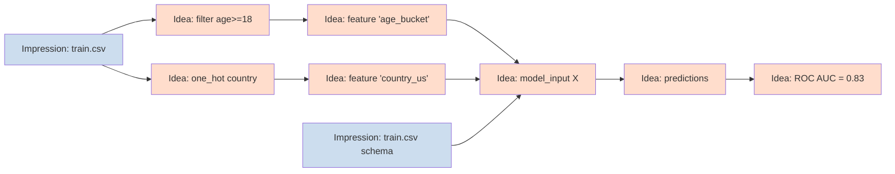
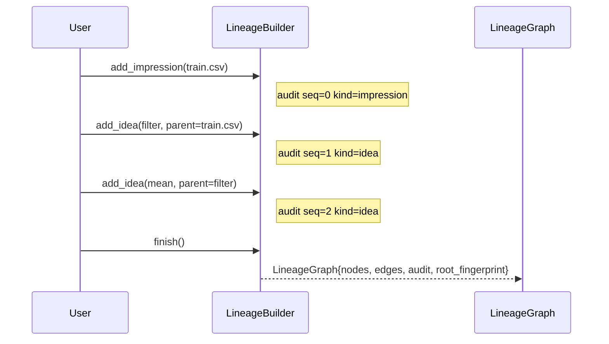

# Locke Lineage and Provenance

## The lineage model

```text
source → cleaning → feature → derived idea → model input → metric / conclusion
```

In Locke this becomes a DAG of two node kinds:

- `LockeImpression` — a raw observed fact (a dataset, a column, a row, a schema)
- `LockeIdea` — a derived value (filtered subset, feature, aggregate, model prediction, metric)

Every Idea has **at least one** parent (Impression or Idea). Impressions have **no** parents.



## Deterministic identity

Every node and edge in a `LineageGraph` is keyed by a content-addressed `FingerprintId`:

- `LockeImpression.id = fingerprint(source, kind_tag, n_rows, schema_fingerprint)`
- `LockeIdea.id       = fingerprint(name, transform.fingerprint, sorted_parent_ids)`
- `LineageEdge` is sorted by `(from, to, label)`; `LineageGraph.root_fingerprint` is the digest of all node IDs + all edge digests.

This guarantees:

- Two runs that produce the same logical graph emit byte-identical text.
- Re-adding a node that's already present is a **no-op** — the graph is idempotent.
- Adding a cyclic edge fails fast with `LineageError::CycleIntroduced`.

## The audit chain

Every mutation appends an `AuditEvent` with:

- `run_label` — user-supplied string scoping the run
- `seq` — monotonically increasing inside the run (no wall clock)
- `kind` — e.g. `"impression"`, `"idea"`
- `subject_id` — fingerprint of the affected node
- `note` — short string

A repeated run produces an audit chain byte-for-byte identical to the original.



## Auto-instrumented pipelines (v0.2)

A `TracedDataFrame` wrapper auto-emits lineage on every transformation:

```rust
use cjc_locke::{lineage::LineageBuilder, TracedDataFrame};

let mut b = LineageBuilder::new("training-2026-05-27");
let _ = TracedDataFrame::observe(&mut b, "train.csv", df_raw)
    .filter("age >= 18", |df| /* … */)
    .select(&["age", "income"], |df| /* … */)
    .with_column("age_bucket", "age / 10", |df| /* … */)
    .into_parts();
let graph = b.finish();
```

Each method (`filter`, `select`, `with_column`, `rename`, `transform`, `concat`) records a `LockeIdea` with deterministic parameter strings and emits a lineage edge from the previous node. No additional bookkeeping is required — the lineage emerges as a side effect of using the wrapper.

The wrapper does **not** mirror `cjc-data`'s full DSL; each method takes a closure for the actual transformation so `cjc-locke` stays decoupled from `cjc-data` internals.

## Building a graph manually

```rust
use cjc_locke::lineage::*;
use std::collections::BTreeMap;

let mut b = LineageBuilder::new("training-2026-05-27");
let p = b.add_impression(LockeImpression::new(
    "train.csv",
    ImpressionKind::Dataset,
    50_000,
    vec!["age".into(), "income".into(), "y".into()],
))?;

let filt = b.add_idea(LockeIdea::new(
    "filter_age_18_plus",
    TransformationRecord {
        op_id: "filter".into(),
        params: BTreeMap::from([("predicate".into(), "age >= 18".into())]),
        seed: None,
    },
    vec![p],
))?;

b.audit_note("milestone", filt, "feature engineering complete");
let graph = b.finish();
assert!(graph.is_acyclic());
```

## Emitting and reading back

The text emit is canonical: equal graphs → equal bytes.

```rust
let text = cjc_locke::lineage::emit_lineage_text(&graph);
// includes: nodes (sorted by id), edges (sorted by from/to/label), audit (in seq order)
```

A future v0.2 will add a binary serialise via `cjc-snap`; for v0 the text emit is the source of truth.

## Limitations

- v0 does not auto-instrument lineage from `cjc-data` pipeline operations. The caller builds the graph explicitly.
- No "lineage diff" yet — you can compare `root_fingerprint`s for equality, but a structural diff is deferred.
- No external/persistent storage; the graph lives in memory until the caller serialises the text emit themselves.

## Tests

- `crates/cjc-locke/src/lineage.rs` — 7 unit tests
- `tests/locke/lineage_tests.rs` — 4 integration tests (text round-trip stability, cycle rejection, audit monotonicity, transitive ancestors)
- `tests/locke/locke_fuzz.rs::fuzz_lineage_operations_never_cycle` — Bolero fuzz over arbitrary op sequences
