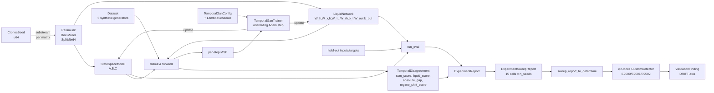

# Cronos GAN — Architecture

The full pipeline reference for `cjc-cronos-gan`: data flow, module responsibilities, the predictor/challenger framing, the determinism stack across phases, and the Locke composition layer that ships in Phase 6.1.

> [!info] Companion notes
> - [[Cronos GAN Phase 1 Overview]] — the original Phase 1–5 narrative
> - [[State Space Model Primitive]] — the SSM construction in depth
> - [[Liquid Neural Network Primitive]] — the Liquid NN gates + τ behaviour
> - [[Adversarial Temporal Training]] — the NCL derivation behind the asymmetric modes
> - [[Cronos GAN Experiment Results]] — Phase 4b / 4c / 4d empirical findings
> - [[Cronos GAN Verification Report]] — the 197-test suite + CI gates

## Pipeline overview



## Per-module responsibilities

| Module | Source | Phase | Responsibility |
|---|---|---|---|
| `seed` | `src/seed.rs` | 1 | [`CronosSeed`] + [`CronosRunId`]; SplitMix64 substream derivation per domain salt |
| `time_series` | `src/time_series.rs` | 1 | [`TimeStep`], [`TimeSeries`], [`TemporalBatch`], [`SequenceMask`], [`ForecastWindow`], [`TemporalLoss`] |
| `temporal_state` | `src/temporal_state.rs` | 1 | [`TemporalState`], [`TemporalTransition`], [`TemporalRollout`] traits |
| `ssm` | `src/ssm.rs` | 1 | Linear time-invariant SSM with `‖A‖_F = α` by construction |
| `liquid` | `src/liquid.rs` | 1 | Liquid network with sigmoid-gated `τ ∈ (τ_min, τ_max)` |
| `disagreement` | `src/disagreement.rs` | 3 | [`TemporalDisagreement`] (ssm_score, liquid_score, absolute_gap, regime_shift_score) |
| `gan` | `src/gan.rs` | 3, 4d | [`TemporalGan`] pair + [`TemporalGanConfig`] with [`LambdaSchedule`] |
| `autograd_ssm` / `autograd_liquid` | `src/autograd_*.rs` | 2 | `Trainable` impls — flat-param round-trip + GradGraph BPTT |
| `training` | `src/training.rs` | 2, 3b | [`Trainable`], [`SupervisedTrainer`], [`ChallengerSpec`] |
| `gan_trainer` | `src/gan_trainer.rs` | 3b | Alternating predictor-then-challenger Adam steps |
| `datasets` | `src/datasets.rs` | 4 | 5 synthetic generators: smooth/noisy sine, regime shift, step change, chaotic spike |
| `experiment` | `src/experiment.rs` | 4, 4b, 4c, 4d | `run_experiment`, `run_experiment_sweep`, [`SweepBaseConfig`], [`SweepCell`], [`CellAggregate`] |
| `schedule` | `src/schedule.rs` | 4d | [`LambdaSchedule`] (Constant / Linear / ExponentialDecay / WarmupThenLinear) |
| `locke_detector` | `src/locke_detector.rs` | 6.1 | DataFrame lift + 3 [`cjc_locke::CustomDetector`] impls (E9500/E9501/E9502) |
| `error` | `src/error.rs` | 1 | [`CronosGanError`] — every fallible op returns this, never panics on user input |

## The architectural opposition

The crate's core idea is to oppose two structurally different temporal models so their *disagreement* becomes an artifact worth inspecting:

| Property | SSM | Liquid NN |
|---|---|---|
| Linearity in (x, u) | Linear | Nonlinear (`tanh` activation, `sigmoid` gate) |
| Time-invariance | Yes — `A, B, C` are fixed | No — `τ(x, h, u)` varies per step |
| Memory regime | Exponential decay at rate `α` | Variable: slow when input stationary, fast otherwise |
| Inductive bias | Smooth continuation | Reactive to local volatility |
| Stability | Structural: `‖A‖₂ ≤ α < 1` by construction | Structural: `τ ∈ (τ_min, τ_max)` by clipping |
| Differentiable | Trivially everywhere | Smooth via sigmoid (Phase 2 refactor) |
| Inspectable state | `StateSpaceState.x` | `LiquidState.h` + `LiquidTimeConstant.tau` + `LiquidGate.gate` |

When the two networks see the **same** input sequence and produce **different** predictions, the gap is the brief's headline signal — a *regime shift* in the underlying process. Both networks are trained to track the target, so the disagreement is calibrated: it's not "one of them is broken", it's "the data just transitioned between regimes that favor different inductive biases."

## The predictor / challenger framing

Standard GANs train a generator to fool a discriminator. Cronos GAN doesn't:

- **Predictor**: a vanilla supervised MSE learner (the "honest" network).
- **Challenger**: a supervised MSE learner with an *additional* `−λ · MSE-vs-predictor` term that *rewards* divergence from the predictor while staying accurate against the target.

Three modes:
- **Symmetric** — both networks are predictors. Disagreement is observed, not trained against.
- **SsmAsGenerator** — SSM is predictor; Liquid is challenger.
- **LiquidAsGenerator** — Liquid is predictor; SSM is challenger.

The Phase 4c held-out evaluation discovered that `SsmAsGenerator` produces the only calibrated disagreement that *transfers* to unseen data (see [[Cronos GAN Experiment Results]] for the empirical-flip details). Phase 4d's `n_seeds=10` validation confirmed the flip is statistically robust.

See [[Adversarial Temporal Training]] for the full derivation showing the challenger loss is exactly Negative Correlation Learning (NCL), and why the predictor-first update ordering is required for determinism.

## Determinism stack

Every layer of the pipeline guarantees byte-identical replay across runs, machines, and platforms. Each layer adds its own contract on top of the layers below.

```
┌────────────────────────────────────────────────────────────┐
│ Layer 6 — sweep_hash (Phase 4d): n_seeds × cells canonical │
│   order; every per-seed replay_hash enters the salt.       │
├────────────────────────────────────────────────────────────┤
│ Layer 5 — replay_hash (Phase 4b → 4d): config bytes +      │
│   seed + final params + training trajectory + disagreement │
│   trajectory + eval-report bytes.                          │
├────────────────────────────────────────────────────────────┤
│ Layer 4 — alternating Adam updates (Phase 3b): predictor   │
│   forward+update completes before challenger reads its     │
│   outputs. Same (config, seed) ⇒ byte-identical trajectory.│
├────────────────────────────────────────────────────────────┤
│ Layer 3 — Adam moments + Kahan-summed gradients (Phase 2): │
│   loss bytes invariant across runs.                        │
├────────────────────────────────────────────────────────────┤
│ Layer 2 — KahanAccumulatorF64 reductions (Phase 1): every  │
│   matvec, every row norm, every loss aggregation.          │
├────────────────────────────────────────────────────────────┤
│ Layer 1 — SplitMix64 substreams (Phase 1): per-matrix      │
│   domain salts ("ssm.A", "liquid.W_tau_u", …). Two domains │
│   never share an RNG stream; one seed produces independent │
│   matrices across SSM + Liquid by construction.            │
└────────────────────────────────────────────────────────────┘
```

Salt-versioning: when the canonical-bytes shape changes (e.g. adding [`LambdaSchedule`] in Phase 4d), the replay-hash salt bumps (`v4c` → `v4d`). Existing hashes don't accidentally collide with the new schema; old hashes become invalid by design.

## Phase progression at a glance

| Phase | Headline contribution | Tests added |
|---|---|---|
| 1 | Temporal primitives + SSM + Liquid + determinism types | ~35 inline |
| 2 | Autodiff + `SupervisedTrainer` + Adam + Kahan-grad | 12 |
| 3 / 3b | `TemporalDisagreement` + `TemporalGan` + asymmetric modes + `TemporalGanTrainer` | 8 + 25 |
| 4 / 4b / 4c | Experiment harness + 15-cell sweep + held-out eval split | 9 + 16 + 14 |
| 4d | `LambdaSchedule` + multi-seed sweep + `CellAggregate` mean/variance | 25 (21 + 4 ignored) + 14 inline schedule |
| 5 / 5b | proptest suite + 7 bolero fuzz targets + CI matrix gates | 10 + 7 |
| 6.1 | [[Cronos GAN Locke Detector]] — DataFrame lift + 3 detectors on DRIFT axis | 19 |
| 6.2 | This documentation set (vault deep-docs) | 0 |
| 6.3 | Python bridge via maturin | — |

Total at Phase 6.2: **197 passing tests + 5 ignored** in release.

## The Locke composition layer (Phase 6.1)

Phase 6.1 lifts Cronos GAN's output into a tabular shape so cjc-locke's detector framework can consume it. The lift is one DataFrame row per [`SweepCell`]:

```
columns: dataset (Str), mode (Str), n_seeds (Float),
         final_loss_ssm + final_loss_ssm_std (Float),
         final_loss_liquid + final_loss_liquid_std,
         mean_absolute_gap + mean_absolute_gap_std,
         max_regime_shift_score + max_regime_shift_score_std,
         eval_ssm_loss + eval_ssm_loss_std,
         eval_liquid_loss + eval_liquid_loss_std,
         eval_absolute_gap + eval_absolute_gap_std
rows:    15 (5 datasets × 3 modes) — canonical order
```

Three detectors consume that DataFrame:
- **E9500** `CronosRegimeShiftDetector` — `max_regime_shift_score > 1.0` (default).
- **E9501** `CronosPersistentDisagreementDetector` — `eval_absolute_gap > 0.5` (default), silent on NaN eval.
- **E9502** `CronosSsmEvalDegradationDetector` — `eval_ssm_loss / final_loss_ssm > 2.0` (default), silent on undefined ratios.

All three declare the [`BeliefAxisSet::DRIFT`] axis, matching the brief's framing of regime shifts as distributional-drift signals.

The detectors are pure functions of the DataFrame — no `Instant::now`, no `HashMap` iteration — and silently no-op on DataFrames missing the expected columns, so accidentally attaching them in `validate(df, opts)` against a non-Cronos table is safe.

See [[Cronos GAN Locke Detector]] (not yet written) and [[ADR-0041]] (cjc-locke custom detector extension layer) for the integration contract.

## What's deferred

- **6.2 vault docs continuation** — this set is the first 6; more topic-specific notes (e.g. dataset characterizations, individual detector deep-dives, sweep-table interpretation guide) can land as separate notes when the use case justifies them.
- **6.3 Python bridge** — maturin + PyO3 binding crate exposing `run_experiment_sweep`, `sweep_report_to_dataframe`, `cronos_default_detectors` to Python. The binding does NOT expose the autodiff layer or `Trainable` — Python users get the high-level reports + detectors, Rust holds the gradients.
- **Vault docs not yet written**: `Cronos GAN Locke Detector.md`, `Cronos GAN Dataset Characterizations.md`. Both are natural follow-ups once the API stabilises.

## Source-map quick reference

```
crates/cjc-cronos-gan/
├── Cargo.toml                             ← deps: cjc-repro, cjc-runtime, cjc-locke, cjc-data, cjc-ad
├── src/
│   ├── lib.rs                             ← public re-exports (3 detectors + lift + LambdaSchedule + …)
│   ├── seed.rs                            ← CronosSeed + CronosRunId
│   ├── time_series.rs                     ← TimeStep, TimeSeries, TemporalBatch, …
│   ├── temporal_state.rs                  ← traits
│   ├── ssm.rs                             ← StateSpaceModel + StateSpaceConfig + validate
│   ├── liquid.rs                          ← LiquidNetwork + LiquidConfig + validate
│   ├── disagreement.rs                    ← compute_disagreement
│   ├── gan.rs                             ← TemporalGan + TemporalGanConfig + LambdaSchedule field
│   ├── autograd_ssm.rs / autograd_liquid.rs ← Trainable impls (GradGraph BPTT)
│   ├── training.rs                        ← Trainable + SupervisedTrainer + ChallengerSpec
│   ├── gan_trainer.rs                     ← Alternating predictor/challenger updates
│   ├── datasets.rs                        ← 5 synthetic generators
│   ├── experiment.rs                      ← run_experiment(_sweep) + Sweep* + CellAggregate
│   ├── schedule.rs                        ← LambdaSchedule (Phase 4d)
│   ├── locke_detector.rs                  ← Phase 6.1 — lift fn + 3 detectors
│   └── error.rs                           ← CronosGanError
├── tests/
│   ├── test_training.rs                   ← Phase 2: 12 supervised training tests
│   ├── test_gan_training.rs               ← Phase 3b: 16 GAN trainer tests
│   ├── test_experiment_sweep.rs           ← Phase 4b: 21 sweep tests
│   ├── test_phase_4c.rs                   ← Phase 4c: 14 eval tests
│   ├── test_phase_4d.rs                   ← Phase 4d: 25 (21 + 4 #[ignore])
│   ├── test_fuzz.rs                       ← Phase 5b: 7 bolero targets
│   ├── test_proptest.rs                   ← Phase 5: 10 properties
│   └── test_locke_detector.rs             ← Phase 6.1: 19 detector + lift tests
├── examples/
│   └── sweep.rs                           ← 5×3 sweep stdout demo (~5-10s release)
└── .github/workflows/cjc-cronos-gan-determinism.yml ← 6 gates × 3 OSes + multi-seed byte-id job
```

## See also

- [[Cronos GAN Phase 1 Overview]] — the original Phase 1–5 narrative
- [[Cronos GAN Phase 4d to 6 Handoff]] — the roadmap that scoped this work
- [[ADR-0044]] — cjc-cronos scaffolding (sibling forecasting crate, shares some primitive conventions)
- [[ADR-0041]] — cjc-locke custom detector extension layer (E9500..=E9999 namespace)
- [[Autodiff]] — the cjc-ad `GradGraph` infrastructure both `Trainable` impls build on
